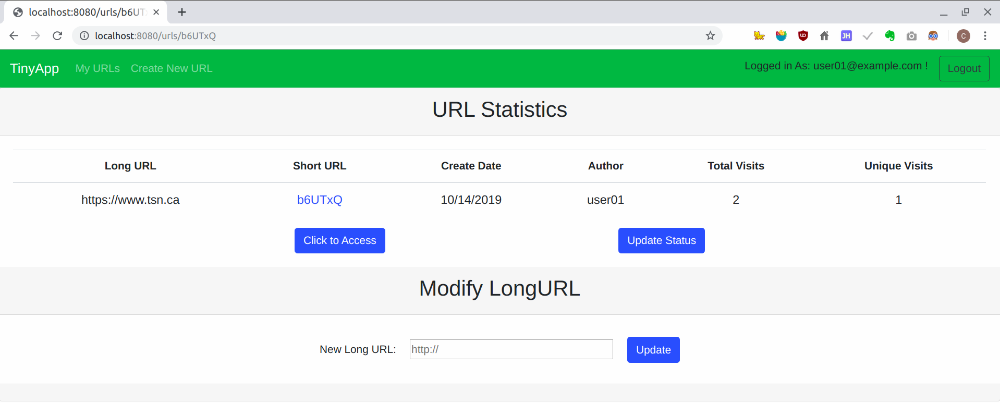

# TinyApp Project

TinyApp is a full stack web application built with Node and Express that allows users to shorten long URLs (à la bit.ly).

## Final Product

Link: [More Screenshots](https://github.com/denven/tinyapp/tree/feature/user-registration/docs) in docs directory.

## Dependencies

- Node.js
- Express
- EJS
- bcrypt
- body-parser
- cookie-session

## Getting Started

- Install all dependencies (using the `npm install` command, if failed to download some files, please try several times).
- Run the development web server using the `node express_server.js` command.

## Test user accounts (three already created in memory):
            email           password
    - user01@example.com      123
    - user02@example.com  purple-monkey-dinosaur
    - tester@example.com  dishwasher-funk

## Functionalities

### Web Pages (By Navigation Header)
- TinyApp(Home Page): http://localhost:8080 or http://localhost:8080/
  - Give message when user has not logined in;
  - Redirect to http://localhost:8080/urls when user has already logined in.

  - My URLs: http://localhost:8080/urls
  - Display current user's shortURL, longURL, creation date, visited times, with "Edit", "Delete" buttons in rows.
  - If no user logined in, only a title will display, no URL info displayed. And a hit message will prompt.
  - If user has logined in, display the user's shortURL information lists.
  - Operation Button:
    - Edit: redirect to shortURL's page http://localhost:8080/urls/b6UTxQ
    - Delete: delete current shortURL information in database without confirmation.

- Create New URL Page: http://localhost:8080/urls/new
  - If you haven't logined on, you will redirect to the Login page when you click "Create New URL".
  - If you've already logined, you have the permit to create shortURL from a longURL.
  - Click "Create" button after inputing a long URL in the text box.
  - A "http://" prefix will add to your URL automatically if you forget to type.
  - Once the shortURL is created, it will redirect to the TinyURL Page with its random ID, eg: http://localhost:8080/urls/VfHfkZ

- Login Page: Open http://localhost:8080/login page when click Login Button
  - If you have created an account, or you can use the test accounts to login in by email/password pair;
  - Invalid email and password will be validated when press login button;
  - Once login on, the user's email will be displayed on top right corner, and a Logout button will display;
  - Login session will keep until you click logout.

- Register Page: Open http://localhost:8080/register page when click Register Button
  - Use an email address and type the identical passwords two times to register;
  - You need to register with an email not used by other registed users;
  - You need to type password twice to ensure you password is correctly typed;
  - Once registered successfuly, you will login on.

- ShortURL Page: The information page to display a shortURL's information
  - e.g, http://localhost:8080/urls/VfHfkZ  `VfHfkZ` is the random shortURL id-string.

  - This page cannot be open from cliking on navigation header;
  - This page can be open from address bar or a click on the "Edit" button in My URLs page;

  - Contents: LongURL string, shortURL string with a link which can be redirect to the actual longURL;
  - Operation: A text box combined with a "Update" button can be used to modify longURL for current shortURL;
  - **Note:**
  - An access to an invalid shortURL(**which doesn't exist in the URL Databse**) will be checked to protect site from crashing;
  - An access to a valid shortURL(but which doesn't belong to the operator) will be limited in this page.
    - LongURL will not be displayed
    - "Update" longURL is not allowed
    - However, access the longURL from shortURL link is always allowed.

### LongURL Access
  - The actual LongURL access from A VALID shortURL(**exists in URL Database**) is **NOT limited** via the FORM of http://localhost:8080/u/xxxxxx from Address bar. eg: http://localhost:8080/u/i3BoGr will be redirected to https://www.goole.ca as this shortURL is created and stored by some user in our database.

### 404 Error Process
  - When the page accessed doesn't exist, it will redirect to a http://localhost:8080/404.html
  - **Note:**   404 error doesn't take the invalid shortURL access while the access URL address is valid, e.g:
    - http://localhost:8080/urls/xxxxx (xxxxx is not a valid shortURL)
    - http://localhost:8080/u/yyyyyy (yyyyy is not a valid shortURL)
    - See **ShortURL Page**

## Technical issue Note
  As we are using a memory database instead of a database saving data on physical disk, all data (created after werb-server started) will lose when web-server restarts (except some hard coded initialised data).

## Related Links
  [TinyApp Requirements](https://web.compass.lighthouselabs.ca/projects/w2-url-shortener?day_number=w03d4)
